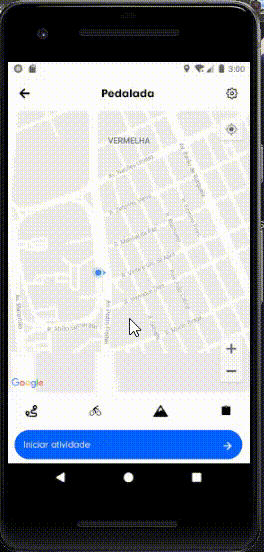

# Criado telas de acordo com o wireframe repassado no figma.

Técnologias usadas: 
 - @react-native-community/geolocation = Para obter localização atual do usuário
 - @react-navigation/native e @react-navigation/native-stack = Para utilizar a navegação do react-navigation
 - react-native-maps = Para utilização do mapa
 - react-native-vector-icons - Para utilização dos ícones que aparecem na tela.
 - styled-components - Para estilização dos componentes via js.

 Preview da utilização do aplicativo: 
 
 